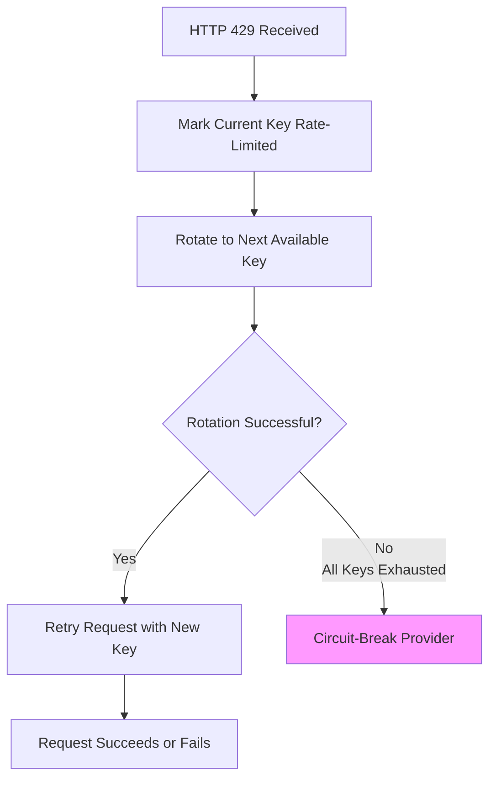

# Key Rotation Guide

Comprehensive guide to Llambo's multi-key rotation system for maximizing rate limits and API capacity.

## Overview

Llambo implements **per-provider key rotation** that automatically rotates between multiple API keys when rate limits (HTTP 429) are encountered. This multiplies your effective rate limits by the number of keys configured.

**Key benefit**: With 3 API keys per provider, you get 3× the rate limit before failover to other providers. This is the **multi-key configuration format** that enables **Multiple API keys** rotation.

## Multi-Key Configuration

### Basic Configuration

Configure multiple API keys via the `api_keys` array (the **api_keys array** format) in provider configuration:

```json
{
  "providers": {
    "openai": {
      "base_url": "https://api.openai.com",
      "model": "gpt-4o",
      "api_keys": [
        "sk-proj-abc123...xyz789",
        "sk-proj-def456...uvw012",
        "sk-proj-ghi789...rst345"
      ],
      "workers": 3,
      "priority": 1,
      "enabled": true
    }
  }
}
```

### Configuration Rules

| Field | Required | Description |
|-------|----------|-------------|
| `api_keys` | No | Array of API strings. If empty, uses `env_var` or default environment variable |
| `env_var` | No | Fallback environment variable for single API key |
| `requires_key` | No | Whether API key required (default: true) |

### Key Resolution Order

1. **`api_keys` array** (preferred): Multiple keys for rotation
2. **`env_var`** (if specified): Single key from custom environment variable
3. **Default environment variable**: `{PROVIDER_NAME}_API_KEY` (e.g., `OPENAI_API_KEY`)
4. **No key**: Only if `requires_key: false` (local models)

## Rotation Behavior

### HTTP 429 → Rotate → Retry Flow

When a provider encounters HTTP 429 (rate limit), key rotation executes this exact flow:



### Step-by-Step Flow

1. **HTTP 429 Received**: Provider returns rate limit error
2. **Mark Current Key**: Current key marked as `RateLimited = true` with timestamp
3. **Rotation Attempt**: System searches for next non-rate-limited key
4. **Retry**: If key found, request retried with new key (same provider)
5. **Exhaustion**: If all keys rate-limited, circuit breaker triggers

### Key State Tracking

Each key maintains:
- `RateLimited`: Boolean (true if currently rate-limited)
- `LimitedAt`: Timestamp when rate-limited
- `Failures`: Consecutive failure count (resets on success)

## Exhaustion Behavior

### When All Keys Are Exhausted

If **all** API keys for a provider are rate-limited (**all keys exhausted**):

| Condition | Action | Cooldown |
|-----------|--------|----------|
| All keys rate-limited<br>No keys available | **Circuit-break provider** | 5 minutes (`RateLimitCooldown`) |
| Key cooldown expires<br>(5 minutes elapsed) | **Key becomes available**<br>Can be used again | - |

### Circuit Breaker Integration

Key rotation integrates with circuit breakers:

```go
if provider.MarkRateLimited() {
    // Rotation successful - retry with new key
    return retryRequest()
} else {
    // All keys exhausted - circuit break provider
    circuitBreaker.Disable(provider)
    return failoverToOtherProvider()
}
```

### Recovery After Exhaustion

After all keys are exhausted:
1. Provider circuit-breaks (5 minute cooldown)
2. During cooldown, requests route to other providers
3. After 5 minutes, keys automatically recover:
   - `RateLimited = false`
   - `Failures = 0`
   - Keys available for rotation again
4. Provider re-enabled in circuit breaker

## Example Scenarios

### Scenario 1: Basic Rotation (3 Keys)

```
Time    Key 1   Key 2   Key 3   Action
-----   -----   -----   -----   ------
00:00   Active  Ready   Ready   Requests use Key 1
00:05   429     ←       ←       Key 1 rate-limited
00:05   Rate    Active  Ready   Rotate to Key 2
00:10           429     ←       Key 2 rate-limited
00:10   Rate    Rate    Active  Rotate to Key 3
00:15                  429      Key 3 rate-limited
00:15   Rate    Rate    Rate    All exhausted → circuit break
00:20   Ready   Ready   Ready   Cooldown expires, keys available
```

### Scenario 2: Partial Rotation Recovery

```
Time    Key 1   Key 2   Key 3   Action
-----   -----   -----   -----   ------
00:00   Active  Ready   Ready   Requests use Key 1
00:05   429     ←       ←       Key 1 rate-limited
00:05   Rate    Active  Ready   Rotate to Key 2
00:10           429     ←       Key 2 rate-limited
00:10   Rate    Rate    Active  Rotate to Key 3
00:15   Ready   Rate    Active  Key 1 cooldown expires (5 min)
00:20   Active  Rate    Ready   Back to Key 1 (available again)
```

### Scenario 3: Mixed Success/Failure

```
Time    Key 1   Key 2   Key 3   Action
-----   -----   -----   -----   ------
00:00   Active  Ready   Ready   Requests use Key 1
00:05   Success ←       ←       Key 1 successful
00:10   429     ←       ←       Key 1 rate-limited
00:10   Rate    Active  Ready   Rotate to Key 2
00:15           Success ←       Key 2 successful
00:20                   429     Key 3 rate-limited (different request)
00:20   Rate    Active  Rate    Continue using Key 2
```

## Configuration Examples

### High-Capacity Setup (Multiple Providers + Multiple Keys)

```json
{
  "providers": {
    "openai-primary": {
      "base_url": "https://api.openai.com",
      "model": "gpt-4o",
      "api_keys": ["sk-key1", "sk-key2", "sk-key3", "sk-key4", "sk-key5"],
      "workers": 5,
      "priority": 1,
      "enabled": true
    },
    "openai-secondary": {
      "base_url": "https://api.openai.com",
      "model": "gpt-4o-mini",
      "api_keys": ["sk-alt1", "sk-alt2", "sk-alt3"],
      "workers": 3,
      "priority": 2,
      "enabled": true
    },
    "openrouter": {
      "base_url": "https://openrouter.ai/api",
      "model": "anthropic/claude-3-5-sonnet",
      "api_keys": ["sk-or1", "sk-or2"],
      "workers": 2,
      "priority": 3,
      "enabled": true
    }
  }
}
```

**Capacity**: 5 keys × OpenAI-primary + 3 keys × OpenAI-secondary + 2 keys × OpenRouter = 10× rate limit multiplier.

### Organization Strategy

Organize keys by purpose:

```json
{
  "openai-general": {
    "api_keys": ["sk-gen1", "sk-gen2", "sk-gen3"]
  },
  "openai-priority": {
    "api_keys": ["sk-pri1", "sk-pri2"],
    "priority": 1
  },
  "openai-backup": {
    "api_keys": ["sk-bak1"],
    "priority": 10
  }
}
```

## Best Practices

### Key Management

1. **Use 3+ keys per provider**: Provides rotation buffer before exhaustion
2. **Distribute keys across accounts/organizations**: Avoid single-account limits
3. **Monitor key usage**: Watch `/providers` endpoint for rate-limited keys
4. **Rotate keys periodically**: Even without 429s, rotate to distribute load

### Configuration Strategy

1. **Match workers to key count**: `workers ≤ api_keys.length` prevents queueing
2. **Priority-based failover**: Lower priority = first choice, higher = fallback
3. **Enable all providers**: Even if disabled, they provide failover capacity
4. **Test rotation**: Trigger 429s in staging to verify rotation works

### Monitoring & Observability

#### Health Endpoints

```bash
# Check key states (masked for security)
curl http://localhost:8080/providers

# Example response
{
  "openai": {
    "healthy": true,
    "keys": [
      {"rate_limited": true, "limited_at": "2024-01-18T12:05:00Z"},
      {"rate_limited": false, "limited_at": null},
      {"rate_limited": false, "limited_at": null}
    ],
    "current_key": 1
  }
}
```

#### Key Metrics to Monitor

- **Rate-limited keys count**: Should rotate between keys
- **Time since last rotation**: Indicates rotation frequency
- **Exhaustion events**: When all keys rate-limited (circuit break)
- **Cooldown recovery**: Keys should recover after 5 minutes

## Common Questions

**Q: How many keys should I configure?**
A: Minimum 3 for effective rotation. More keys = more rate limit headroom.

**Q: What happens if I have only 1 key?**
A: HTTP 429 immediately circuit-breaks the provider (no rotation possible).

**Q: Can keys have different rate limits?**
A: Yes - rotation works with any key. Different accounts/organizations may have different limits.

**Q: How are keys selected during rotation?**
A: Round-robin selection of non-rate-limited keys. Cooldown-expired keys are reset automatically.

**Q: Can I manually mark a key as rate-limited?**
A: Not via API. Restart with modified `api_keys` array (remove problematic key).

**Q: What's the cooldown duration?**
A: 5 minutes (`RateLimitCooldown` in `providers/constants.go`).

**Q: How does this work with batch jobs?**
A: Key rotation applies per-request. Jobs distribute across keys via provider rotation.

**Q: Can I see which key served a request?**
A: Not in response headers. Monitor `/providers` endpoint for current key index.

## Troubleshooting

### No Rotation Occurs

**Symptoms**: HTTP 429 immediately circuit-breaks provider.

**Check**:
1. `api_keys` array is configured (not empty)
2. Multiple keys in array (≥2)
3. `workers` setting allows concurrent requests
4. Provider appears in `/providers` response

### Keys Don't Recover After Cooldown

**Symptoms**: Keys stay rate-limited beyond 5 minutes.

**Check**:
1. System clock synchronization
2. Cooldown duration (5 minutes default)
3. `/providers` endpoint shows `limited_at` timestamps

### Uneven Key Usage

**Symptoms**: One key gets all 429s, others unused.

**Check**:
1. Key validity (all keys work)
2. Rotation logic via `MarkRateLimited` calls
3. Request distribution across `workers`

### All Providers Exhausted

**Symptoms**: All providers circuit-broken, no requests succeed.

**Solution**:
1. Add more keys to providers
2. Add more provider diversity (different APIs)
3. Reduce `workers` to stay under rate limits
4. Implement client-side request throttling

**Note**: When **All providers exhausted**, the system has no healthy backends. Monitor `/health` to prevent this state.